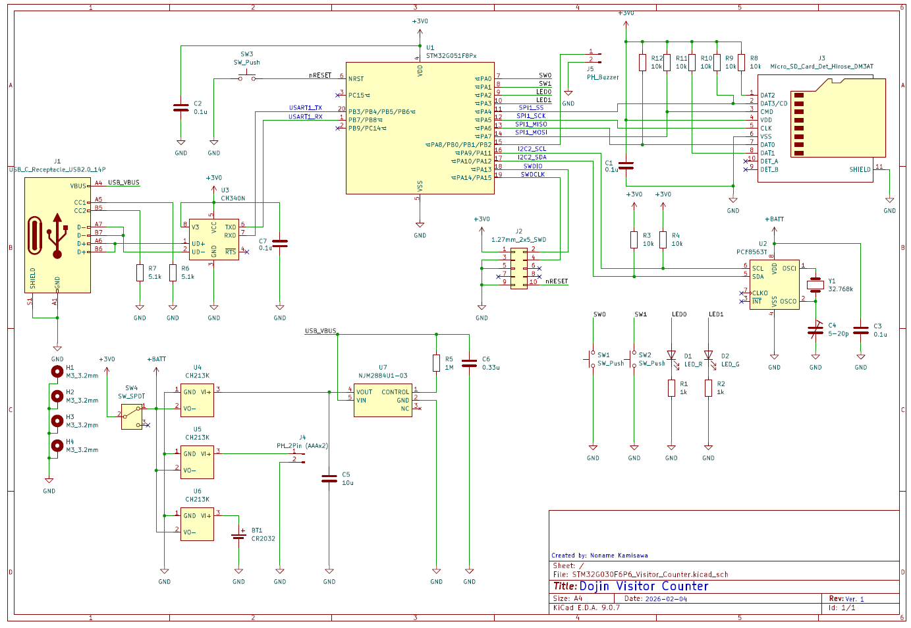

# 来場者カウンター for 即売会 (小規模量産対応版)

[来場者カウンター for 即売会](https://github.com/nnm-t/rp2040-visitor-counter) の小規模量産対応版

## 発案

しーさいど氏 ([@SeasideExp](https://x.com/SeasideExp)) の[このポスト](https://x.com/SeasideExp/status/1992435754606428389)

## プリント基板

- 69 x 44 x 1.6 mm
  - [タカチ製SW-75ケース](https://www.takachi-el.co.jp/products/SW)に収まる
  - 部品はすべて表面に実装。なるべく実装高さを抑えた
- 設計した基板は[JLCPCB](https://jlcpcb.com/jp/)へ発注
- 表面実装部品を多く使用したため、はんだ付けは慣れていないと大変かも

### 回路図

## 部材

秋月電子通商とDigiKeyですべて揃う

### 秋月電子通商で購入

|ID|種別|メーカー|型番|パッケージ|数量|
|:--|:--|:--|:--|:--|--:|
|BT1|電池ホルダー|COMFORTABLE ELECTRONIC|[BC-2001](https://akizukidenshi.com/catalog/g/g106925/)|表面実装|1|
|C1,C2,C3,C7|積層セラミックコンデンサ (0.1μF)|村田製作所|[GCM188L81H104KA57](https://akizukidenshi.com/catalog/g/g116143/)|表面実装 (1608)|4|
|C4|トリマコンデンサ (5-20pF)|Shenzhen Topmay Electronic|[TMCV01-20P100VBR](https://akizukidenshi.com/catalog/g/g115471/)|スルーホール|1|
|C5|積層セラミックコンデンサ (10uF)|村田製作所|[GRM188R6YA106MA73](https://akizukidenshi.com/catalog/g/g113161/)|表面実装 (1608)|1|
|D1|LED (赤)|OptoSupply|[OSR50603C1E](https://akizukidenshi.com/catalog/g/g108274/)|表面実装 (1608)|1|
|D2|LED (緑)|OptoSupply|[OSG50603C1E](https://akizukidenshi.com/catalog/g/g108275/)|表面実装 (1608)|1|
|J1|USB Type-C レセプタクル|Neltron Industrial|[5077CR-16-SMC2-BK-TR](https://akizukidenshi.com/catalog/g/g114356/)|スルーホール|1|
|J2|1.27mmピッチ ピンヘッダ (2x5P)|Chang Enn|[PH11-2x5SAG](https://akizukidenshi.com/catalog/g/g113800/)|スルーホール (1.27mm)|1|
|J3|TFカードスロット|ヒロセ電機|[DM3AT-SF-PEJM5](https://akizukidenshi.com/catalog/g/g102395/)|表面実装|1|
|J4,J5|PHコネクタ ベース付ポスト (2P)|日本圧着端子製造|[S2B-PH-K-S](https://akizukidenshi.com/catalog/g/g112633/)|スルーホール (2mm)|1|
|R1,R2|カーボン抵抗 (1kΩ)|KOA|[RK73B1JTTD102J](https://akizukidenshi.com/catalog/g/g130351/)|表面実装 (1608)|2|
|R3,R4,R8,R9,R10,R11,R12|カーボン抵抗 (10kΩ)|KOA|[RK73B1JTTD103J](https://akizukidenshi.com/catalog/g/g130355/)|表面実装 (1608)|7|
|R5|カーボン抵抗 (1MΩ)|KOA|[RK73B1JTTD105J](https://akizukidenshi.com/catalog/g/g130359/)|表面実装 (1608)|1|
|SW1,SW2|タクトスイッチ (12mm)|Switronic Industrial|[1273HIM-160G-G](https://akizukidenshi.com/catalog/g/g102561/)|スルーホール|2|
|SW3|タクトスイッチ (6mm)|Cosland|[DTS-63-N-V-WHT](https://akizukidenshi.com/catalog/g/g103648/)|スルーホール|1|
|SW4|スライドスイッチ|XIAMEN JINBEILI ELECTRONICS|[SS-12D00G3](https://akizukidenshi.com/catalog/g/g115707/)|スルーホール|1|
|U3|USBシリアル変換IC|WCH|[CH340N](https://akizukidenshi.com/catalog/g/g116305/)|SOP8|1|
|U4,U5,U6|理想ダイオード|WCH|[CH213K](https://akizukidenshi.com/catalog/g/g129462/)|SOT-23-3|1|
|U7|低損失レギュレータ (3V500mA)|日清紡マイクロデバイス|[NJM2884U1-03](https://akizukidenshi.com/catalog/g/g110896/)|SOT89-5|1|
|Y1|水晶振動子 (32.768kHz)|セイコーエプソン|[FC-135 32.768000KHz12.5](https://akizukidenshi.com/catalog/g/g107195/)|表面実装|1|
|-|PHコネクタ ハウジング (2P)|日本圧着端子製造|[PHR-2](https://akizukidenshi.com/catalog/g/g112795/)|-|2|
|-|PHコネクタ コンタクトピン|日本圧着端子製造|[SPH-002T-P0.5L](https://akizukidenshi.com/catalog/g/g112837/)|-|4|
|-|圧電スピーカー|SPL (Hong Kong)|[PT08-Z185R](https://akizukidenshi.com/catalog/g/g101251/)|-|2|
|-|電池ボックス (単4x2)|COMFORTABLE ELECTRONIC|[SBH-421-1AS](https://akizukidenshi.com/catalog/g/g100348/)|-|1|

### DigiKeyで購入

マルツ経由での取り寄せも可能

|ID|種別|メーカー|型番|パッケージ|数量|
|:--|:--|:--|:--|:--|--:|
|C6|積層セラミックコンデンサ (0.33μF)|TDK|[C1608X8R1E334K080AC](https://www.digikey.jp/ja/products/detail/tdk-corporation/C1608X8R1E334K080AC/6556503)|1608|1|
|R6,R7|カーボン抵抗 (5.1kΩ)|KOA|[RK73B1JTTD512J](https://www.digikey.jp/ja/products/detail/koa-speer-electronics-inc/RK73B1JTTD512J/9844732)|1608|2|
|U1|ARMマイコン|STMicroelectronics|[STM32G051F8P6](https://www.digikey.jp/ja/products/detail/stmicroelectronics/STM32G051F8P6/18086216)|TSOP20|1|
|U2|リアルタイムクロック|NXP|[PCF8563T/5,518](https://www.digikey.jp/ja/products/detail/nxp-usa-inc/PCF8563T-5-518/2606091)|SOP8|1|

### 消耗品

- CR2032
- 単4電池 x2
- TFカード (32GBまで)

## ファームウェア

- ピン配置設計 & コード生成: STM32CubeMX
- ビルド環境: CMake
- プログラムサイズは約56～7KB、RAM使用量は約11KBで、64KB FlashのSTM32G051F8でもあまり余裕がない
  - 当初はSTM32G030F6を使う予定だったが、プログラムが入り切らなかったのでマイコンを変更
  - プログラムが大きくなったのはI2C, SPI, USART, TIMとそこそこペリフェラルを使用し、FatFSも組み込んだからか？

## 使い方

- コネクタJ4に電池ボックスを、J5にブザーを接続
- 電池ボックスに単4電池2本を入れて電池ボックスのスイッチを入れるか、USB Type-Cポートにケーブルを接続する
  - 試作品と異なり、保護回路があるので電池とUSBから同時に給電しても故障しない
- カードスロットJ3にTFカードを挿入する
- スライドスイッチSW4を動かして電源を入れる
  - バックアップ用のCR2032が挿入済で、電池残量がある限り、電源を切っても時刻は保持される
  - TFカード未挿入で電源を入れたり、読み込めない状態だと、緑色LEDが点灯する

### 初期設定

- USB Type-CポートでPCと接続し、シリアル通信 (115200bps, 改行コード: LF) で時刻設定をする
  - 時刻設定が済んでいない状態 (またはバックアップ用のCR2032が未装着or交換直後) で起動すると、赤色LEDが点灯する
  - 時刻の設定: `set 20XX/XX/XX XX:XX:XX` (Enterキー)
  - 時刻設定が完了すると赤色LEDが消灯する

### カウント操作

- スイッチSW1またはSW2を押すと、TFカードにスイッチを押した時刻とスイッチの種別がCSV形式で1行ずつ記録される
  - CSVファイルは日付別に作成される
  - SW1を押すと赤色LEDが、SW2を押すと緑色LEDが点灯し、1秒後に消灯する。同時にブザーも鳴る
- チャタリング防止機能があり、LEDが消灯するまでは次のスイッチ操作を受け付けない
